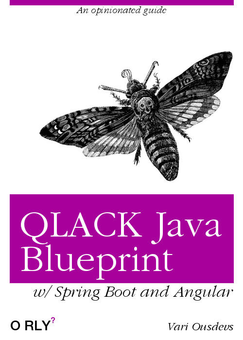

# QJB: QLACK Java Blueprint

## 0. Preface
QJB is not a library; it is not a framework either but rather a collection of practices
and designs we have been using again and again in our projects. We wanted to put all
such knowledge under the same roof to allow people to quickly bootstrap Java-based, Angular
webapps without having to deal with common project bootstrapping headaches. We provide
and end-to-end guide (i.e. from your front-end down to your persistence layer) as well
as an assortment of sample projects and source code snippets.

Please be aware: QJB is a very opinionated blueprint not only regarding the specification of
its technical stack but also in naming conventions, folder structure, etc. We understand that "one size fits all"
may not be what you are looking for but we value consistency (across projects) a lot. Having
said that, we are very open to new ideas, suggestions, enhancements, and generally any other
change that could be incorporated into this blueprint making it even better. So, feel free to submit
your ideas in [issues](https://github.com/eurodyn/iwjb/issues) or via PRs.

> TOC

## 1. Technical stack
Modern Java projects contain a myriad of technical choices and the aim of this
section is not to list them all. So here we go with just the basics:

* Java 8
* Spring Boot 2.x
* Angular 6.x
* Maven

* JPA / Hibernate
* QueryDSL
* Mapstruct
* Lombok
* Material Design
* Flex-layout

> TBC

## 2. Project structure

## 3. Parent POM

> TBC: Why keeping versions in properties instead of dependencyManagement.

## 4. Back-end

> TBC: Managing dependencies using SB's version: Do not include a version
tag (to use SB's version) unless compilation fails with error; in that case
use your own version.

> TBC: Wrapping exceptions in REST to not leak low-level exceptions.

> TBC maintaining and updating the DB schema

## 5. Front-end

> TBC: Discussion: Do we need modules?

> TBC: Routing (app-constants.ts + app-routes.ts)

> TBC: Use reactive forms only.

## 6. Running & Debugging
This chapter demonstrates how you can run your application during development and how you
can debug your code while your application is running.

### 6.1 Front-end
Running your front-end application is utilising the built-in mechanism of Angular CLI. Nothing fancy
here, just issue `ng serve` and you are _almost_ good to go.

So, 'why the almost?' I hear you saying.
> TBC proxy.conf.json

> TBC `ng serve --proxy-config proxy.conf.json`

You can now access your front-end at: [http://localhost:4200](http://localhost:4200).

### 6.2 Back-end

> TBC `mvn clean spring-boot:run -Dspring-boot.run.jvmArguments="-agentpath:/JREBEL -Xdebug -Xrunjdwp:transport=dt_socket,server=y,suspend=n,address=5000"`

> TBC DB schema?

## 7. Security

## 8. Testing

## 9. Packaging & Delivering

## 10. CI/CD/QA

## 11. Cases & Samples